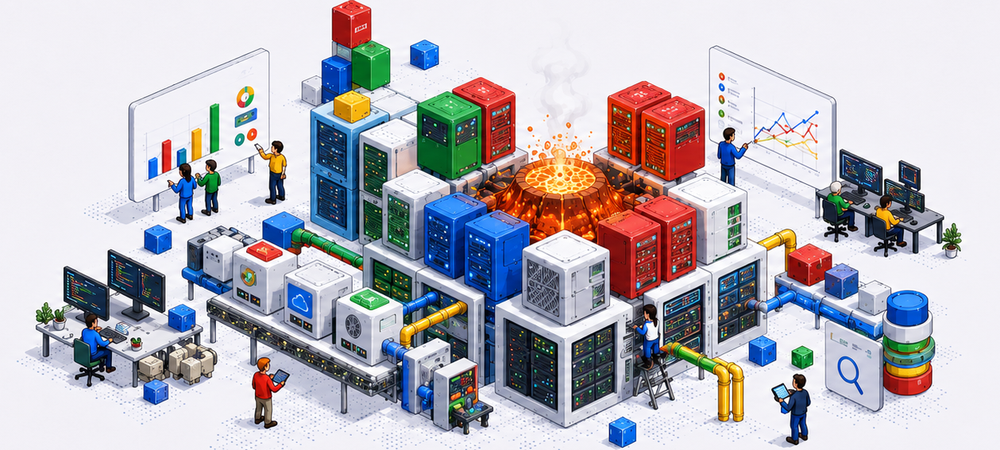

### Engineering effectiveness · Legacy .NET modernization · CI/CD systems · Test reliability · Dependable software delivery

---

Welcome and thank you for visiting my page! You'll find practical tools, reference implementations, and technical documentation developed around the problems enterprise engineering teams encounter when software becomes difficult to change, test, release and operate.

I have over 15 years of experience building and improving production systems across gaming, retail, higher education and consumer analytics. My work spans application architecture, cloud services, build infrastructure, automated testing, enterprise integration, modernization and operational reliability.

---

### Areas of Focus

* Engineering effectiveness and delivery-system diagnosis
* Legacy .NET modernization and migration sequencing
* CI/CD architecture and build orchestration
* Automated testing and test reliability
* Release readiness and deployment verification
* Cloud architecture and distributed systems
* Observability and operational resilience
* Developer workflows and internal engineering tools
* Measurement of delivery outcomes

---

### Professional Experience

My work has included:

* Improving .NET development workflows and TeamCity build systems
* Designing automated controls that reduce production defects
* Building scalable and highly available services on Microsoft Azure
* Modernizing applications that had reached end of life
* Introducing automated testing and continuous integration practices
* Integrating complex enterprise and third-party systems
* Replacing manual operational processes with engineering tools
* Leading technical initiatives and mentoring software engineers

---

### Professional Impact

* Designed an automated grade-audit system that helped protect the academic records of more than 2,000 students
* Built Azure services that supported substantial growth in a digital commerce platform
* Increased point-of-sale data capacity by refactoring enterprise ETL processes
* Improved team efficiency by 66% through custom .NET and Python automation
* Maintained an enterprise application serving more than 50,000 daily users
* Contributed five learning-performance metrics to the Caliper Analytics 1.2 specification
* Led modernization, automated testing, and continuous integration initiatives across aging application portfolios

---

### Engineering Perspective

Software delivery is a difficult problem to solve:

* A slow pipeline may originate in architecture

* An unreliable test suite may reflect unclear ownership or weak isolation

* A modernization effort may fail because the work was sequenced incorrectly

* A productivity initiative may increase activity without improving delivery

Identifying the core issues often requires being clear on what the business constraints are. Only then can a solution be tailored to solve the organization's most important needs.

---

### Technologies

#### Core

* C# and .NET
* TeamCity
* Azure DevOps
* Selenium and browser automation
* SQL Server
* Docker and Kubernetes

#### Additional Experience

* Python, JavaScript, and TypeScript
* Microsoft Azure and AWS
* REST, SOAP, GraphQL, and distributed services
* PostgreSQL, MySQL, MongoDB, and Cosmos DB
* React, Angular, Node.js, and Django
* Application Insights, CloudWatch, Redis, and event-driven systems

---

### Writing

I write about:

* Engineering effectiveness
* Legacy .NET modernization
* CI/CD friction and release reliability
* Test automation and test reliability
* Developer workflows
* Delivery-system bottlenecks
* Modernization sequencing
* Measurement of engineering outcomes

---

### Connect

